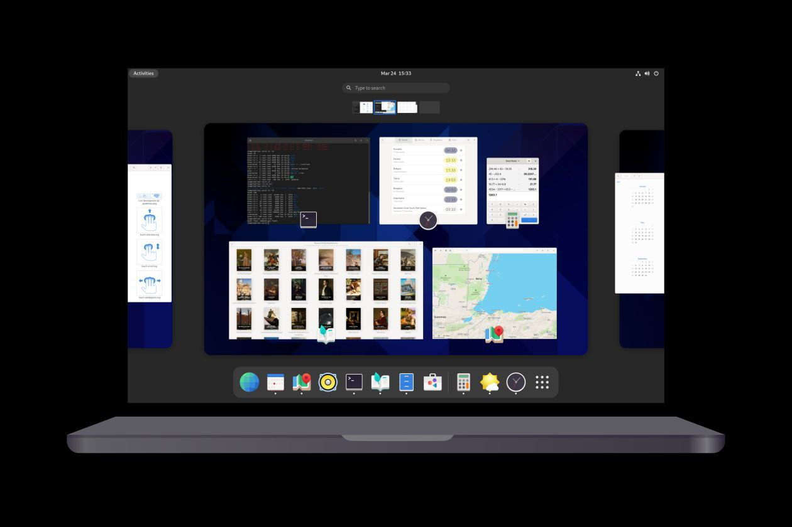

<!-- =======================================================
  * Template Name: Antares-OS - v2.0
  * Author: José Valdemir de Melo
  ======================================================== -->  
<p align="center">

</p>

# <p align="center">_Como criar sua própria versão customizada do_ *GNU/Linux*</p>

# <p align="center">_Como funciona_</p>
Escolhi utilizar o processo manual de customização do GNU/Linux, utilizando o yad. rsync, zenity, squashfs-tools, chroot e genisoimage, é simples, você usa a própria distribuição instalada como base, sem aplicativos extras, que às vezes é incompatível dependendo da distribuição.

As pessoas poderão criar versõespara distribuição entre amigos com a finalidade de divulgação do *Linux* ou como base de aprendizado.

# <p align="center"> Requisito
Computador (Desktop ou Notebook) com Linux instalado, porém sugiro utilizar a versão mais atual disponível.
<p align="center">

</p>

 _Para melhor entendimento do conteúdo aqui descrito, você deve baixar a ISO, esta ISO é só a base do debian 13.6 82 MB_ 
<p align="center">
<a href="https://drive.google.com/file/d/1JsnFQbOECJqL1ez-Sh-7vx4cuRQvNifS/view?usp=drive_link"></p>  
 
# Live CD
### Pré-requisitos

_Agora, vamos criar um diretório para manipular os arquivos que utilizaremos durante todo processo._

_Para criar o ambiente para customização, necessitamos de:_
```bash
sudo apt install yad rsync squashfs-tools genisoimage
```
Para virtualização
```bash
sudo apt install gnome-boxes
```
### Criar diretório 
Cria o diretório e os subdiretórios
```bash
mkdir -p $HOME/Distro/{chroot,antares/live,files}
cd Distro
```
Ativando o módulo do Kernel
```bash
sudo modprobe squashfs
```
### Copiar ISO
Copia a ISO para o ambiente de customização
```bash
Antares=$(yad --file --center --separator=" " --multiple --title "Escolha a ISO para copiar");
printf "%s\n" ${Antares}
[ -z "$Antares" ] && { yad --error --center --title "Copiar" --text "Operação cancelada pelo usuário" 2>/dev/null;exit;}
cp $Antares $HOME/Distro/
```
### Extrai os arquivos da ISO
* Monta a ISO e faz um loop na pasta mnt
* rsync sincroniza as pastas mnt com a pasta antares
* Monta o sistema de arquivos na pasta squashfs
* Copia os arquivos da pasta squashfs para a pasta chroot
```bash
sudo mount -o loop *.iso mnt
rsync --exclude=/live/filessystem.squashfs -a mnt/ antares
sudo mount -t squashfs -o loop mnt/live/filesystem.squashfs squashfs
sudo cp -a squashfs/* chroot/
```
### Configuração de ambiente para uso do chroot
* Copia configuração de rede para o nosso sistema de customização
* Copia configuração do localhost 127.0.0.1
* Monta o /dev
* Monta o /proc
* Monta o /sys
Agora vem a loucura, dá um chroot e ter acesso total a pasta de customização
```bash
sudo cp /etc/resolv.conf chroot/etc/
sudo cp /etc/hosts chroot/etc/
sudo mount --bind /dev chroot/dev
sudo mount --bind /proc chroot/proc
sudo mount --bind /sys chroot/sys
sudo chroot chroot
```

### Permissão na pasta onde vai ser modificados os arquivos
chmod 755 é a permissão mais usada em servidores de hospedagem de sites. Ele mantém o diretório e o arquivo seguros e protegidos, impedindo que terceiros façam alterações.
```bash
sudo chmod -R 755 antares/
```
### Executando chroot
Configuração de ambiente para uso do chroot
Copia o arquivo /etc/resolv.conf para chroot/etc/
```bash
sudo cp /etc/resolv.conf chroot/etc/
```
Copia o arquivo /etc/hosts para chroot/etc/
```bash
sudo cp /etc/hosts chroot/etc/
```
Monta o /dev em chroot/dev
```bash
sudo mount --bind /dev chroot/dev
```
Monta o /proc em chroot/proc
```bash
sudo mount --bind /proc chroot/proc
```
Monta o /sys em chroot/sys
```bash
sudo mount --bind /sys chroot/sys
```
Agora vamos fazer chroot na pasta de customização
```bash
sudo chroot chroot
```
### Adicionando repositório
Aqui eu vou mostrar duas opçoẽs de edição do sources.list
- [ ]  Editor nano
```bash
sudo nano /etc/apt/sources.list
```
- [x] Com o comando cat
```bash
cat > /etc/apt/sources.list << 'EOF'
deb http://deb.debian.org/debian trixie main non-free-firmware contrib non-free
deb http://deb.debian.org/debian trixie-updates main non-free-firmware contrib non-free
deb http://deb.debian.org/debian trixie-proposed-updates main non-free-firmware contrib non-free
deb http://security.debian.org/debian-security/ trixie-security main non-free-firmware contrib non-free
EOF
```
### Atualizar o sistema
Atualizar o sistema
```bash
apt update && apt dist-upgrade -y
```
Pacotes a serem instalados para o sistema preview, para instalação do sistema use o calamares
```bash
apt-transport-https build-essential btrfs-progs curl dbus-x11 dosfstools dkms rsync e2fsprogs exfatprogs efibootmgr \
linux-image-amd64 live-boot live-config squashfs-tools genisoimage isolinux lsb-base grub-common grub2-common \
grub-efi-amd64 grub-efi-amd64-bin wget os-prober gnome-accessibility-themes gnome-disk-utility gnome-terminal \
gnome-shell gnome-shell-common gnome-shell-extension-prefs gnome-shell-extensions gnome-software gnome-session \
gnome-tweaks nautilus mutter gdm3 xinit gnome-control-center xdg-user-dirs-gtk gedit file-roller
```
Instalar os drivers firmware-linux-nonfree
```bash
apt install firmware-amd-graphics firmware-ast firmware-ath9k-htc firmware-atheros firmware-bnx2 firmware-bnx2x \
firmware-brcm80211 firmware-cavium firmware-intel-sound firmware-ipw2x00 firmware-ivtv firmware-iwlwifi firmware-libertas \
firmware-linux firmware-linux-free firmware-linux-nonfree firmware-misc-nonfree firmware-myricom firmware-netronome \
firmware-netxen firmware-nvidia-tesla-gsp firmware-qcom-soc firmware-qlogic firmware-realtek firmware-realtek-rtl8723cs-bt \
firmware-samsung firmware-siano firmware-sof-signed firmware-ti-connectivity firmware-zd1211
```
Instalar o calamares
```bash
apt install calamares calamares-settings-debian
```
### Excluir arquivos
Caso tenha alterado o kernel, use o comando a seguir
```bash
apt remove --purge linux-image-x.x.x-xx-amd64
```
### Instalar pacotes extras

Exemplo de instalação manual de programas extras, configuração e remoção
```bash
cd home
```
Instalando programas de fontes externas
```bash
wget https://dl.google.com/linux/direct/google-chrome-stable_current_amd64.deb
```
Instalar com o dpkg e instalar as dependências
```bash
dpkg -i *.deb 
apt -f install -y
apt update && apt upgrade -y
```
Remover programas desnecessários
```bash
rm -r *.deb
```
Sair
```bash
cd
```
# Arquivos temporários
Removendo arquivos de configuração
Removendo arquivos temporários e finalizando o Chroot
_Os arquivos temporários e o cache do APT, deve ser apagados para diminuir a ISO imagem a ser gerada. Neste ponto nós desmontaremos os filesystems e finalizar o chroot, pois apenas as tarefas de customização são necessárias neste ambiente, as terefas de criação da ISO devem ser feitas fora do chroot. Para remover os arquivos temporários e os outros arquivos que não serão mais necessários._
Limpar o cache do APT
```bash
apt clean
```
Removendo os arquivos temporários
```bash
rm -rf /tmp/* ~/.bash.history
rm /etc/resolv.conf
rm /etc/hosts
```
### Finalizar chroot
```bash
exit
```
### Desmontar filesystems
Desmontar os filesystems de customização não nescessários e finalizar o chroot
```bash
sudo umount -lf chroot/dev
sudo umount -lf chroot/proc
sudo umount -lf chroot/sys
sudo umount -lf squashfs
sudo umount -lf mnt
```
### Excluir pastas e arquivos temporárias
Este comando exclue todos os arquivos da pasta live
```bash
sudo rm -r antares/live/*
```
Exclue a ISO temporária
```bash
sudo rm -r $HOME/Distro/*.iso
```
Exclue pastas temporárias
```bash
sudo rm -r mnt && sudo rm -r squashfs
```
Exclue vmlinuz e initrd e o lançador calamares
```bash
sudo rm -r chroot/usr/share/applications/calamares.desktop.orig
sudo rm -r chroot/vmlinuz && sudo rm -r chroot/vmlinuz.old
sudo rm -r chroot/initrd.img && sudo rm -r chroot/initrd.img.old
```
Copiar o vmlinuz e o initrd para a pasta live na raiz do cd
```bash
cp $HOME/Distro/chroot/boot/vmlinuz-* $HOME/Distro/antares/live/vmlinuz
cp $HOME/Distro/chroot/boot/initrd.img-* $HOME/Distro/antares/live/initrd.lz
```
### Squashfs
Regerando os arquivos, o filesystem.manifest e filesystem.squashfs
```bash
chmod +w antares/live/filesystem.manifest
sudo chroot chroot dpkg-query -f '${binary:Package} ${Version}\n' -W > antares/live/filesystem.manifest
sudo cp antares/live/filesystem.manifest antares/live/filesystem.manifest
sudo rm antares/live/filesystem.squashfs
sudo mksquashfs chroot antares/live/filesystem.squashfs -comp xz
```
### MD5sum
Criar o MD5sum
```bash
cd antares
sudo rm md5sum.txt
find -type f -print0 | xargs -0 md5sum | grep -v isolinux/boot.cat | tee md5sum.txt
cd
cd Distro
```
### Gerando s imagem ISO
Criando a imagem ISO com genisoimage
```bash
genisoimage \
-D -r -V “Antares-OS” -cache-inodes -J -l -b isolinux/isolinux.bin -c isolinux/boot.cat \
-no-emul-boot -boot-load-size 4 -boot-info-table -o Antares-OS-amd64-$(date +%d-%m-%Y).iso antares/
```

Excluir o diretório e subdiretório não vazio
_Para excluir o diretório e os subdiretórios que não estejam vazios, é necessário desmontar o ponto de montagem, use a opção -r (recursiva). Para ser claro, isso remove os diretórios e todos os arquivos e subdiretórios contidos neles:_

### Excluir diretório
Excluir diretório de customização
```bash
sudo rm -r Distro
```
# Desenvolvedor
   <!-- ======= Footer ======= -->
  <footer id="footer">
    <div class="container">
      <h3>Antares OS</h3>
      <h5 class="font-italic">
      <div>Tudo sobre remasterização de imagens ISOs customizada do seu GNU/Linux.</div>
      </h5>
      <div class="social-links">
        <a href="https://valdemir26.github.io/" class="telegram"><i class="bx bxl-github"></i></a>
        <a href="https://www.youtube.com/@antaresOS/videos" class="telegram"><i class="bx bxl-youtube"></i></a>
        <a href="https://t.me/valdemir26antaresOS" class="telegram"><i class="bx bxl-telegram"></i></a>
        <a href="https://twitter.com/jvmelo26?s=09" class="twitter"><i class="bx bxl-twitter"></i></a>
        <a href="https://www.facebook.com/josevaldemir.melo" class="facebook"><i class="bx bxl-facebook"></i></a>
        <a href="https://www.instagram.com/josevaldemir.melo/" class="instagram"><i class="bx bxl-instagram"></i></a> 
      </div>
      <div class="copyright">
        &copy; Copyright <strong><span> Antares OS </span></strong> 2020 2026 All Rights Reserved
      </div>
      <div class="credits">
      Sobre mim <a href="https://valdemir26.github.io/">José Valdemir de Melo</a>
      </div>
    </div>
  </footer>

